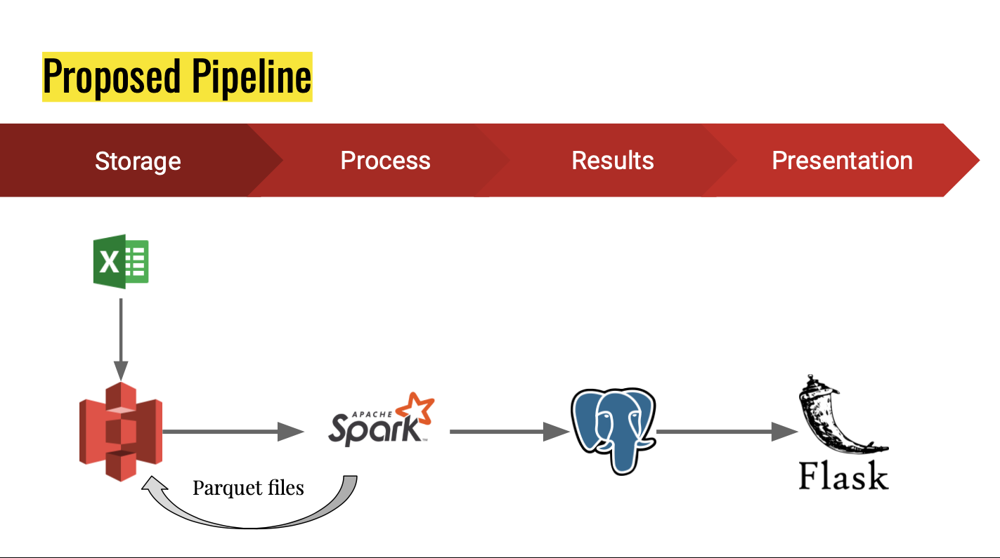
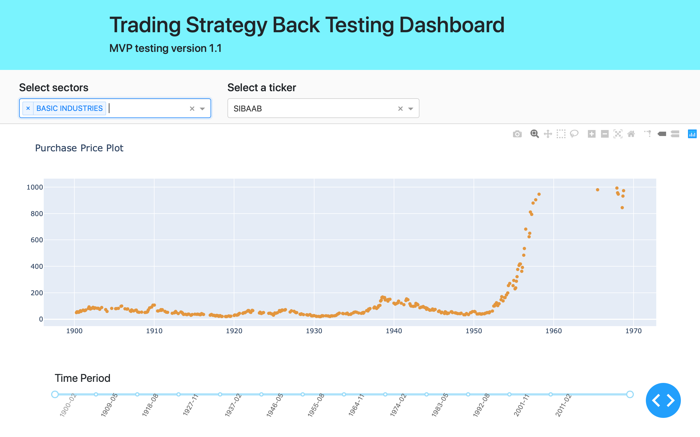

# Back In Time

## Table of Contents

1. [Motivation](#motivation)
2. [Overview](#overview)
3. [Pipeline](#pipeline)
4. [Dataset](#dataset)
5. [Conversion](#conversionn)
6. [Transformation](#transformation)
7. [Database](#database)
8. [Visualization](#visualization)
9. [Vision](#vision)
10. [Notes](#notes-on-setting-the-environment)

## Motivation
In my previous jobs, I have seen the same problems with data management over and over again, 
across different countries and industries. Often, employees work on some Excel files 
and save them in their local machine or shared drive on a daily basis. 
Over the time and possibly several rounds of staff turn-overs,
the daily files become unmanageable. Besides security and cost concerns, 
it is almost impossible to use those historical data efficiently. 

To address this ubiquitous problem, I build a pipeline that will help companies bettter manage their historical data, 
so the security, cost and efficiency issues could be addressed properly.


## Overview
The main idea of this project is to build a pipeline that helps business to better handle their historical files.


Therefore, following along the pipeline, I am going to demonstrate how to migrate large amount of csv files, 
close to 2000 csv files and about 437GB in total, of different sizes to AWS S3 bucket; 
converting cvs files into parquet files to be stored in S3 bucket; performing a naive trading strategy with the whole dataset and 
export the results to a postgres database. Finally, I build a front end for the user to interact with the results in database.

The structure of the directory are mapped according to this tree:
```
backtesting
    |- api
        |- api_18080.py
    |- cli
        |- useful.sh
    |- comparison
        |-
    |- dash
        |- app_dash.py
    |- db
        |- schema.sql
    |- python
        |- connect_s3.py
        |- create_table.py
    |- simulation
        |- GBM.py
        |- merton_jump.py
        |- dates_generator.py
        |- price_generator_final.py
    |- spark
        |- field_detector.py
        |- file_convertor.py
        |- strategy.py
```


## Dataset
The most common business use case I assume would be that companies have many different sizes of files and most likely time series data that need to be aggregated for further consumption.
In order to test out this scenario, I simulated the following files and stored them in S3 bucket. 

|Number of csv files|Size of csv file (MB)|
|---|---|
|1,251|70|
|500|140|
|200|350|
|100|700|
|100|1,400|

Each file contains historical stock prices using Merton's Jump SDE model, with a 6 digits ticker, from 1900 to 2019. 

Why csv files?

Since MS Excel is [arguably the most important computer program in workplace around](https://www.investopedia.com/articles/personal-finance/032415/importance-excel-business.asp) the world. 
Microsoft used to brag the total user of Excel is 1.5 billion. Although I can't find it on their website anymore,
given the popularity I believe this is not far off. Therefore, focusing on how to handle large amount of different sizes of csv files seems to be a good choice.


## Conversion
```file_convertor.py``` reads in the csv file from S3 bucket and write to S3 bucket as parquet files
```field_detector.py``` infer the header types from the csv file, translate the spark data types to postgres types, 
and store those in a postgres table. Another function in the file is to auto create a table in database and insert the 
csv data into the table. 

why parquet files?
1. fast in reading which is appropriate in this case since writing is one-off while reading is much more frequent
2. columnar format which is suitable for time-series data
3. Spark SQL faster with large parquet files
4. Parquet with compression reduces data storage cost and disk IO which reduces input data needs.

Testing results shows that reading in many csv files are much slower than reading in one parquet file of the same size.
It seems to be a good choice to convert many csv files into one large parquet file at once to greatly enhance the performance.
After conversion, 70G of csv files will be compressed to a 40G parquet file.

### Transformation
The defined naïve trading strategy goes as follows: for each beginning of the month, choose to buy 100 dollar worth of a stock
if the price of 7-day moving average is less than the previous day closing price. Profit and Loss (PnL) for each trad is simply calculated 
from the multiplication of the volume, and the difference of the last price of the period for each stock and the purchase price
Finally, for each stock each day if there is a purchase, the purchase price, volume, last price and PnL will be
saved in a table in Postgres Database.  100 dollar and 7-day are variables arbitrarily chosen for simplicity.

After tuning the spark job, processing each 40G parquet file takes 17-21 mins.

### Database
Sample of the result table.


### Visualization
Multiple choice dropdown of sectors which determines the tickers' dropdown list.
Rangeslider for the time period.


### Vision

Plan for futher development.


### Notes on setting the environment

1. Following this [pegasus](https://blog.insightdatascience.com/how-to-get-hadoop-and-spark-up-and-running-on-aws-7a1b0ab55459) 
instruction to start a spark cluster on EC2 instances. In this case, there are 3 workers and 1 master all on m4.large 
Ubuntu 16.04 images.
2. Install all the necessary packages according to requirements.txt
3. Configure for Spark History Server. 
    - Useful [link](https://www.ibm.com/support/knowledgecenter/en/SS3MQL_1.1.1/management_sym/spark_configuring_history_service.html)
     on how to configure spark history server.
        
    - Modify spark-defaults.conf file under directory /usr/local/spark/conf. In this case, a folder called spark-events is created under /tmp/
    that will be used for storage of the history logs.
        ```
        spark.eventLog.enabled         true
        spark.eventLog.dir             file:///tmp/spark-events
        spark.history.fs.logDirectory  file:///tmp/spark-events
        ```
    - Start the spark service
        ```
        $cd /usr/local/spark/sbin/ && sudo ./start-history-server.sh
        ```
    - If it is a success, you should see this on your screen:
        ```
        starting org.apache.spark.deploy.history.HistoryServer, logging to /usr/local/spark/logs/spark-root-org.apache.spark.deploy.history.HistoryServer-1-ip-10-0-0-6.out
        ```
    - And now WebUI with port 18080 should work
4. Configure for connecting to Postgres Database, in this case M4.Large EC2 instance, 16.04 Ubuntu image.

5. Run Spark
```
export PYSPARK_PYTHON=python3;
export SPARK_CLASSPATH= <path to downloaded jar>/postgresql-42.2.8.jar

pyspark
spark-submit --driver-class-path <path to downloaded jar>/postgresql-42.2.8.jar  <file_name>.py
```